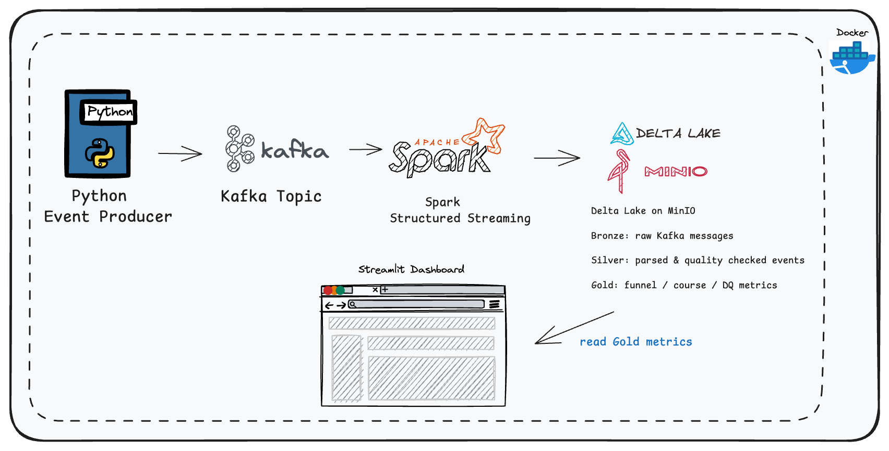
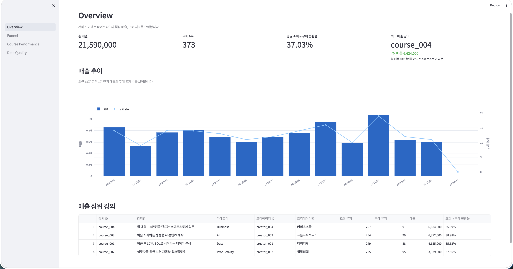
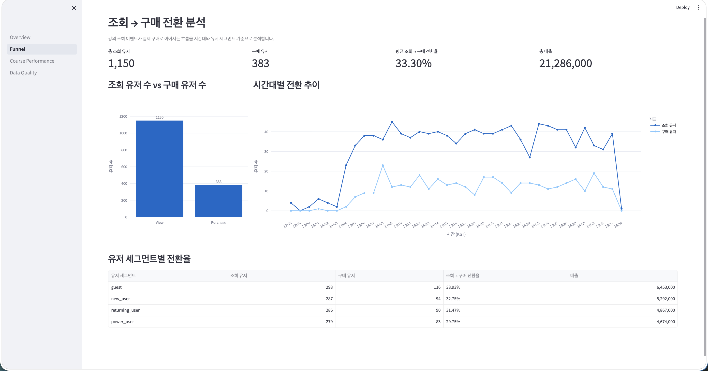
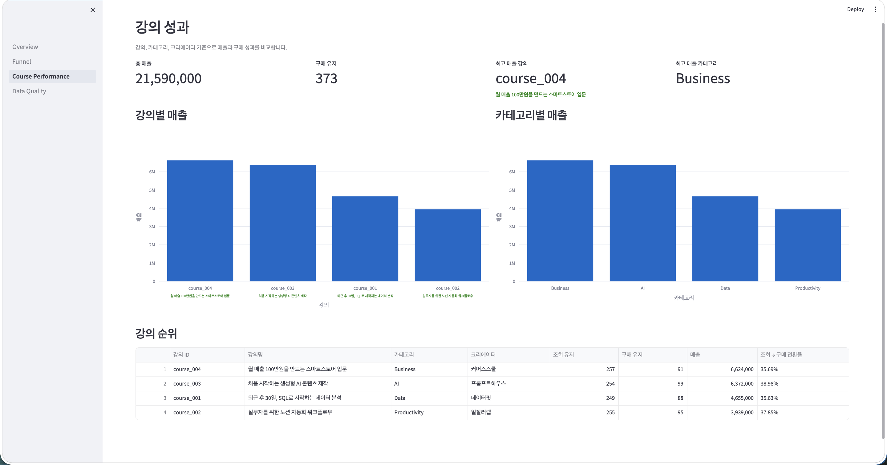
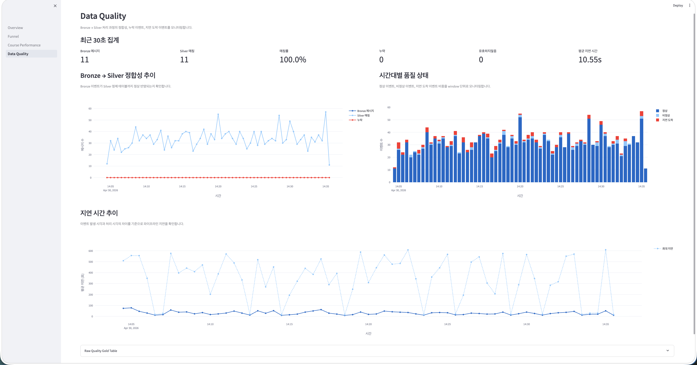

# LiveClass Event Pipeline

## 1. 프로젝트 개요
이 과제는 단순히 이벤트 로그를 생성하고 저장하는 것을 넘어,
온라인 클래스 서비스에서 발생하는 사용자 행동 이벤트를 안정적으로 수집하고,
분석 가능한 형태로 정제하여 30초 주기로 갱신되는 대시보드를 제공하는 데이터 플랫폼을 구현하는 것을 목표로 했습니다.

저는 특히 다음 세 가지를 중점으로 설계했습니다.

1. Kafka 기반 이벤트 수집과 Delta Lake 기반 원본 보존
2. Bronze-Silver-Gold 레이어 분리를 통한 재처리 가능성 및 데이터 품질 추적
3. 구매 전환, 수강 진행률, 데이터 정합성을 확인할 수 있는 Streamlit 대시보드

---

## 2. 실행 방법

### 2.1. 환경

- Docker Desktop 설치 및 실행

### 2.2. 실행

```bash
docker compose up -d --build
```

서비스가 순서대로 뜨는 데 약 1~2분이 소요됩니다. Gold 테이블은 spark-consumer가 Silver를 먼저 적재한 이후 gold-processor가 처음 실행될 때 생성됩니다. 대시보드에 데이터가 표시되기까지 최초 실행 후 약 1~2분을 기다려야 합니다.

### 2.3. 접근 주소

| 서비스 | 주소 |
|---|---|
| Streamlit Dashboard | http://localhost:8501 |
| MinIO Console | http://localhost:9001 (minioadmin / minioadmin) |
| Kafka (외부) | localhost:9094 |

### 2.4. 종료 및 초기화

```bash
# 종료
docker compose down

# 볼륨 포함 완전 초기화
docker compose down -v
```

---

## 3. 문제 이해와 요구사항 해석

과제에서 제가 핵심으로 해석한 요구사항은 다음과 같습니다.

1. 이벤트 로그 생성
   - 단순 랜덤 이벤트가 아니라 온라인 클래스 서비스에서 실제로 의미 있는 행동의 이어짐을 표현해야 한다고 판단했습니다.
   - 따라서 class_view, purchase, video_play, video_complete 이벤트를 설계했습니다.

2. 데이터 수집 및 저장
   - 이벤트 로그는 시간이 지나며 지속적으로 발생하는 데이터이므로 Kafka를 통해 수집하고,
     Spark Structured Streaming으로 Delta Lake에 적재했습니다.

3. 분석 가능한 데이터 모델
   - Raw 로그를 바로 대시보드에서 읽는 대신,
     Bronze-Silver-Gold 레이어로 분리하여 원본 보존, 정제, 집계를 구현했습니다.

4. 분석 결과 시각화
   - 단순 이벤트 수 집계뿐 아니라 매출, 구매 전환, 수강 완료율, 데이터 품질을 확인할 수 있도록 대시보드를 구성했습니다.

---

**설계 범위와 트레이드오프**

이번 과제에서는 Airflow, Prometheus, Grafana 등 별도의 운영 도구는 제외했습니다.

로컬 Docker Compose 환경에서 과제 요구사항을 재현하는 것이 목적이기 때문에,
스케줄링과 인프라 모니터링보다는 이벤트 수집, 저장, 정제, 집계, 시각화를 안정적이고 명확히 보여주는 데 집중했습니다.

대신 데이터 품질 지표는 별도 Gold 테이블로 저장하여 Streamlit에서 확인할 수 있도록 구성했습니다.

---

## 4. 아키텍처

### 4.1. 전체 구조



### 4.2. 컴포넌트 역할

| 컴포넌트 | 역할 |
|---|---|
| Producer | 4개 강의, 4개 유저 세그먼트 기반 세션 이벤트 생성 및 Kafka 발행 |
| Kafka | 이벤트 메시지 브로커 (KRaft 모드, 토픽: `liveclass-events`) |
| Spark Consumer | Kafka 구독 -> Bronze 원본 적재 -> Silver 파싱/검증 |
| Gold Processor | Silver 읽기 -> 비즈니스 지표 집계 -> Gold 테이블 저장 (30초 주기) |
| MinIO | Delta Lake 저장소 역할의 S3 호환 오브젝트 스토리지 |
| Dashboard | Gold 테이블 직접 읽어 4개 페이지 시각화 |

---

## 5. 데이터 흐름

이벤트 종류를 많이 늘리기보다는, 온라인 클래스 서비스에서 가장 기본적인 행동인
조회 -> 구매 -> 수강 시작 -> 수강 완료에 집중했습니다.

이 흐름만 있어도 구매 전환율, 강의별 매출, 수강 완료율, 데이터 품질 같은 핵심 지표를 만들 수 있고,
과제 범위 안에서 파이프라인의 전체 흐름을 설명하기에 충분하다고 생각했습니다.

### 5.1. Producer -> Kafka

데이터는 class_view를 시작으로, 이후 사용자의 행동은 확률적으로 purchase, video_play, video_complete로 이어집니다.

이 과제에서는 유료 온라인 클래스 서비스를 가정했고, 핵심 퍼널은 다음과 같이 정의했습니다.

```
class_view -> purchase (35%) -> video_play (75%) -> video_complete (55%)
```

- class_view: 강의 상세페이지 조회
- purchase: 강의 구매
- video_play: 구매 이후 수강 시작 (purchase한 세션에서만 발생)
- video_complete: 수강 완료 (video_play 이후에만 발생)

구매하지 않은 유저에게는 video_play, video_complete 이벤트가 생성되지 않습니다. 이벤트는 pending queue를 통해 실제 발생 시각에 맞춰 순차 발생됩니다.

파이프라인의 품질 검증 기능을 실제로 확인하기 위해 이상치를 포함했습니다.

| 이상치 유형 | 비율 | 내용 |
|---|---|---|
| invalid | 3% | null 필드, 알 수 없는 event_type, purchase에 price 누락 |
| late_arrival | 5% | 3~10분 지연된 event_time |
| duplicate | 2% | 동일 이벤트 재발행 |

### 5.2. Bronze (원본 보존)

Kafka 메시지를 파싱 없이 raw_payload 그대로 Delta Lake에 append합니다.

| 컬럼 | 설명 |
|---|---|
| kafka_topic | Kafka 토픽명 |
| kafka_partition | Kafka 파티션 번호 |
| kafka_offset | Kafka offset (lineage key 구성 요소) |
| kafka_timestamp | Kafka 브로커 수신 시각 |
| message_key | Kafka 메시지 키 |
| raw_payload | JSON 원본 문자열 |
| ingested_at | Bronze 적재 시각 |

저장 경로: `s3://warehouse/bronze/events`

### 5.3. Silver (정제 및 검증)

JSON 파싱, 강의 dimension broadcast join, 이벤트 품질 판정을 수행합니다.

**event_quality_status 판정 기준**

| 상태 | 조건 |
|---|---|
| `invalid` | event_id / event_type / user_id / course_id / event_ts 중 null 존재, 미정의 event_type, purchase인데 price null, course_name null (dimension 미매핑) |
| `late_arrival` | `latency_sec > 120` |
| `valid` | 나머지 |

`latency_sec = processing_time - event_ts` (Spark 처리 시각 - 이벤트 발생 시각)

| 주요 컬럼 | 설명 |
|---|---|
| event_id | 이벤트 고유 ID |
| event_type | class_view / video_play / video_complete / purchase |
| event_ts | 이벤트 발생 시각 (UTC) |
| user_id | 유저 ID |
| session_id | 세션 ID |
| user_segment | guest / new_user / returning_user / power_user |
| course_id | 강의 ID |
| course_name | 강의명 (dimension join) |
| category | 강의 카테고리 (dimension join) |
| creator_id / creator_name | 크리에이터 정보 (dimension join) |
| price | 결제 금액 (purchase 이벤트만 존재) |
| device_type | mobile / desktop / tablet |
| country | KR / US / JP / VN |
| event_quality_status | valid / invalid / late_arrival |
| event_date | 파티션 키 (event_ts 기준 날짜) |

저장 경로: `s3://warehouse/silver/events` (event_date 파티션)

### 5.4. Gold (집계 분석)

Gold Processor는 30초 주기로 Silver를 읽어 아래 3개 테이블을 갱신합니다.

#### 5.4.1. funnel_metrics

`s3://warehouse/gold/funnel_metrics`

1분 단위 시간 구간과 사용자 세그먼트별로 강의 상세 조회 수, 구매 수, 매출, View -> Purchase 전환율을 집계합니다.

따라서 시간대별 구매 전환 흐름과 신규/재방문/파워 유저 간 전환율 차이를 비교할 수 있습니다.

| 컬럼 | 설명 |
|---|---|
| window_start / window_end | 1분 집계 window (KST 변환은 대시보드에서 수행) |
| user_segment | 유저 세그먼트 |
| view_users | class_view 고유 유저 수 |
| purchase_users | purchase 고유 유저 수 |
| revenue | window 내 구매 매출 합계 |
| view_to_purchase_rate | purchase_users / view_users |

Purchase -> Play, Play -> Complete 같은 전환율은 집계하지 않습니다. 이유는 [7.3. window 단위 퍼널 집계의 범위] 항목에서 설명합니다.

#### 5.4.2. course_metrics

`s3://warehouse/gold/course_metrics`

전체 기간 Silver를 강의 단위로 집계합니다.

| 컬럼 | 설명 |
|---|---|
| course_id / course_name / category / creator_id / creator_name | 강의 dimension |
| unique_users / unique_sessions | 강의별 고유 유저/세션 수 |
| view_events / play_events / complete_events / purchase_events | 이벤트 유형별 발생 수 |
| view_users / play_users / complete_users / purchase_users | 이벤트 유형별 고유 유저 수 |
| revenue | 누적 매출 |
| view_to_purchase_rate | 강의 상세페이지 전환율 |

#### 5.4.3. data_quality_metrics

`s3://warehouse/gold/data_quality_metrics`

Bronze와 Silver를 Kafka lineage key (`topic-partition-offset`)로 join하여 30초 window 단위로 파이프라인 정합성을 측정합니다.

| 컬럼 | 설명 |
|---|---|
| total_bronze_messages | Bronze에 적재된 메시지 수 |
| matched_silver_messages | Silver에서 확인된 메시지 수 |
| missing_in_silver_messages | Bronze에만 존재하는 메시지 수 |
| bronze_to_silver_match_rate | matched / total |
| valid_events / invalid_events / late_arrival_events | 품질 상태별 이벤트 수 |
| valid_rate / invalid_rate / late_arrival_rate | 품질 상태별 비율 |
| avg_latency_sec / max_latency_sec | 처리 지연 통계 |

---

## 6. 대시보드

`http://localhost:8501` 에서 접속합니다.

### 6.1. Overview


전체 비즈니스 현황을 요약하는 페이지입니다.

- KPI: 총 매출, 구매 유저, 평균 조회 -> 구매 전환율, 최고 매출 강의
- 매출 추이: 최근 15분, 1분 단위 매출과 구매 유저 수를 이중축 차트로 표시
- 매출 상위 강의 테이블

### 6.2. 조회->구매 전환 분석

조회 -> 구매 전환 분석 페이지입니다.

- KPI: 총 조회 유저, 구매 유저, 평균 조회 -> 구매 전환율, 총 매출
- 조회 유저 수 vs 구매 유저 수 막대 차트
- window 단위 시간대별 전환 추이 시계열 차트
- 유저 세그먼트별 전환율 테이블

Purchase -> Play, Play -> Complete 전환율은 windowed countDistinct 합산 문제로 이 페이지에서 제외했습니다.

### 6.3. 강의 성과

강의별 매출 및 전환 성과 페이지입니다.

- KPI: 총 매출, 구매 유저, 최고 매출 강의, 최고 매출 카테고리
- 강의별 매출 막대 차트 (강의명 표시)
- 카테고리별 매출 막대 차트
- 강의 순위 테이블

### 6.4. 데이터 품질

파이프라인 정합성 모니터링 페이지입니다.

- KPI: 최근 30초 window 기준 Bronze 메시지, 매칭률, 누락, 유효하지않음, 평균 지연 시간
- Bronze -> Silver 정합성 추이 차트
- 시간대별 품질 상태 스택 바 차트
- 지연 시간 추이 차트
- Raw Gold 테이블 (expander)

---

## 7. 설계 의사결정

### 7.1. Bronze는 파싱 없이 raw 보존

Bronze에는 Kafka 메시지를 파싱하지 않고 `raw_payload` 그대로 저장했습니다.

이벤트 스키마는 프로젝트가 진행되면서 바뀔 수 있고, Silver의 파싱 로직도 언제든 수정될 수 있습니다. 이때 Bronze에 원본 메시지가 남아 있어야 기존 데이터를 다시 파싱하거나, 잘못된 정제 로직을 수정한 뒤 재처리할 수 있습니다.

처음에는 Bronze 단계에서 바로 필요한 컬럼을 분리하는 방식도 고려했지만, 그렇게 하면 Bronze가 원본 저장소라기보다 1차 정제 테이블에 가까워지기 때문에 Bronze를 재처리 가능한 원천 로그 저장소로 두는 것이 더 안전하다고 판단했습니다.

---
### 7.2. Dimension 데이터는 Silver에서 join

강의명, 카테고리, 크리에이터 정보는 Producer 이벤트에 포함하지 않고, Silver 처리 단계에서 `course_id` 기준으로 broadcast join했습니다.

Producer는 사용자의 행동 이벤트를 생성하는 역할에 집중하고, 강의/카테고리/크리에이터 같은 기준 정보는 Silver 레이어에서 보강하는 구조가 더 명확하다고 판단했습니다.

또한 dimension 정보가 Producer에 직접 들어가면 같은 `course_id`라도 이벤트마다 강의명이나 카테고리가 다르게 들어올 수 있습니다. 반대로 Silver에서 단일 dimension 테이블을 참조하면 기준 정보의 정합성을 한 곳에서 관리할 수 있습니다.

`course_name.isNull()`을 Silver invalid 조건에 포함하여, dimension에 매핑되지 않은 이벤트가 Gold 집계에 유입되지 않도록 방어했습니다.

---
### 7.3. window 단위 퍼널 집계의 범위

`funnel_metrics`는 1분 window 단위로 `countDistinct(user_id)`를 계산합니다.  
따라서 여러 window를 단순 합산하면 동일 유저가 여러 번 계산될 수 있습니다.

이 프로젝트에서는 실시간 대시보드에서 시간대별 조회 수, 구매 수, 조회 -> 구매 전환율을 빠르게 확인하는 데 초점을 맞췄습니다. 그래서 window 단위 집계를 사용했습니다.

다만 `Purchase -> Play`, `Play -> Complete`처럼 여러 이벤트가 시간차를 두고 발생하는 퍼널은 단순 window 집계만으로는 정확하게 보기 어렵기 때문에, 이런 분석은 `user_id`, `session_id`, `course_id` 기준으로 이벤트 순서를 재구성한 별도 Gold 테이블로 분리하는 편이 더 적절하다고 판단했습니다.

---
### 7.4. Gold 갱신 방식: UPSERT와 overwrite를 구분

Gold 테이블은 성격에 따라 갱신 방식을 다르게 선택했습니다.

| Gold 테이블 | 방식 | 이유 |
|---|---|---|
| data_quality_metrics | UPSERT | 30초 window 단위로 계속 누적되며, 동일 window가 재계산될 수 있음 |
| funnel_metrics | overwrite | 과제 데이터 규모에서는 전체 재계산이 단순하고 빠름 |
| course_metrics | overwrite | window 없이 전체 Silver 기준으로 강의별 성과를 다시 계산하는 구조 |

`data_quality_metrics`는 Bronze와 Silver의 정합성을 보는 운영성 지표입니다. 동일한 30초 window가 다시 계산될 수 있기 때문에 `window_start`, `window_end`를 키로 UPSERT하여 중복 적재를 방지했습니다.

반면 `funnel_metrics`와 `course_metrics`는 현재 과제 규모에서는 전체 재계산 후 overwrite하는 방식이 더 단순하고 이해하기 쉽다고 판단했습니다. 운영 환경에서 데이터가 커진다면 partition 단위 overwrite, 최근 window만 재계산하는 증분 처리, 또는 `foreachBatch` 기반 집계로 바꾸는 것이 적절합니다.


### 7.5. Timestamp 관리: UTC 저장, KST 표시

모든 테이블의 timestamp는 UTC로 저장하고, KST 변환은 대시보드에서만 수행했습니다.

저장 단계에서 KST로 변환하면 Spark 처리 시간, Kafka 이벤트 시간, 대시보드 표시 시간이 섞이면서 기준 시간이 불명확해질 수 있습니다. 특히 여러 시스템이 붙는 파이프라인에서는 저장 시간의 기준을 하나로 유지하는 것이 중요하다고 생각했습니다.

그래서 Delta Lake에는 UTC 기준으로 저장하고, 사용자가 보는 Streamlit 대시보드에서만 `Asia/Seoul` 기준으로 변환하여 저장 계층과 표시 계층의 책임을 분리했습니다.

### 7.6. Gold 집계는 과제 범위에서 단순 배치로 구현

현재 Gold Processor는 Bronze/Silver Delta 테이블을 읽어 필요한 지표를 재계산합니다. 과제 환경에서는 로컬에서 짧은 시간 동안 생성한 작은 데이터를 대상으로 하기 때문에, 구현 복잡도를 줄이기 위해 단순 배치 구조를 선택했습니다.

다만 운영 환경에서 데이터가 계속 쌓이면 전체 테이블 스캔 비용이 커질 수 있습니다. 실제 운영에서는 최근 window만 읽는 증분 처리, partition pruning, Delta Change Data Feed, 또는 Structured Streaming의 `foreachBatch`를 활용한 방식으로 개선하는 것이 필요하다고 생각합니다.

이번 프로젝트에서는 완전한 운영 최적화보다 Bronze-Silver-Gold 흐름, 품질 검증, 비즈니스 집계가 끝까지 연결되는 구조를 우선했습니다.

---

## 8. 한계 및 개선 방향

### 8.1. cross-session 퍼널 분석

현재 funnel_metrics의 View -> Purchase 전환율은 같은 1분 window 내 집계입니다. 실제 서비스에서는 사용자가 강의를 보고 며칠 후 결제하는 경우도 많으므로, user_id 기반 non-windowed 집계를 별도 Gold job으로 추가해야 정확한 퍼널 분석이 가능합니다.

### 8.2. Dimension 관리

현재 COURSE_DIMENSION은 spark-consumer 코드 내에 하드코딩되어 있습니다. 강의가 추가되거나 카테고리가 변경되면 코드를 수정하고 재배포해야 합니다. 실제 서비스라면 운영 DB 또는 별도 API에서 dimension을 읽어오는 구조로 변경이 필요합니다.

### 8.3. 알림 및 모니터링

Data Quality 지표는 현재 대시보드에서만 확인 가능합니다. `bronze_to_silver_match_rate` 임계값 미달이나 `invalid_rate` 급등 시 Slack 같은 채널로 알림을 보내는 구조가 운영 환경에서는 필요합니다.

### 8.4. 확장성

현재 구조는 로컬 Docker Compose 기반이지만, Kafka -> AWS MSK, MinIO -> S3, Spark -> EMR 또는 Databricks, 대시보드 -> ECS/EKS로 전환하면 동일한 설계로 프로덕션 환경에서도 운영 가능합니다.

---

## 9. 선택과제 A — Kubernetes 배포 설계

### 9.1. 매니페스트 구성

`k8s/` 디렉토리에 이벤트 생성기 Producer를 Kubernetes에 배포한다고 가정하고, 다음 3개의 매니페스트를 작성했습니다.

```
k8s/
├── namespace.yaml            # liveclass 네임스페이스 생성
├── producer-configmap.yaml   # Producer 실행 환경 설정
└── producer-deployment.yaml  # Producer 애플리케이션 배포
```

적용 순서: `namespace.yaml` -> `producer-configmap.yaml` -> `producer-deployment.yaml`

ConfigMap과 Deployment는 모두 liveclass 네임스페이스를 사용하므로, 네임스페이스를 먼저 생성해야 합니다.

### 9.2. 선택한 Kubernetes 리소스와 이유

#### Namespace

Namespace는 Kubernetes 리소스를 논리적으로 분리하기 위한 단위입니다.

이번 과제에서는 Producer 관련 리소스를 default 네임스페이스에 바로 두지 않고, liveclass 네임스페이스로 분리했습니다. 작은 과제 환경에서는 필수는 아니지만, 실제 운영 환경에서는 서비스별로 리소스를 구분하고 권한, 쿼터, 배포 범위를 관리하는 경우가 많기 때문입니다.

#### ConfigMap

ConfigMap은 애플리케이션 코드와 실행 환경 설정을 분리하기 위해 사용했습니다.

Producer는 Kafka로 이벤트를 발행하므로 KAFKA_BOOTSTRAP_SERVERS, KAFKA_TOPIC 같은 설정이 필요합니다. 이 값은 Docker Compose 환경과 Kubernetes 환경에서 달라질 수 있습니다.

예를 들어 Docker Compose에서는 Kafka 주소가 kafka:9092일 수 있지만, Kubernetes 내부에서는 Kafka Service 이름을 기준으로 kafka-service:9092처럼 접근합니다. 그래서 이 값을 코드에 직접 박아두지 않고 ConfigMap으로 분리했습니다. 실제 매니페스트에서도 Kafka 접속 주소와 토픽명을 ConfigMap에 선언해 두었습니다.  

이렇게 하면 실행 환경이 바뀌어도 Producer 이미지를 다시 빌드하지 않고, ConfigMap만 수정해서 설정을 바꿀 수 있습니다.

#### Deployment

Deployment는 Producer 파드를 실행하고, 장애가 발생했을 때 다시 띄우기 위해 사용했습니다.

Producer는 외부 요청을 받는 API 서버가 아니라, Kafka에 이벤트를 계속 발행하는 백그라운드성 애플리케이션입니다. 단순히 Pod로 실행할 수도 있지만, Pod가 죽으면 직접 다시 생성해야 합니다. 반면 Deployment는 선언한 개수만큼 파드가 유지되도록 관리해주기 때문에 Producer처럼 계속 살아 있어야 하는 프로세스에 더 적합합니다.

이번 설정에서는 replicas: 1로 두었습니다. Producer를 여러 개 실행하면 이벤트 생성량이 인스턴스 수만큼 늘어나고, 과제에서 의도한 데이터 발생량보다 훨씬 커질 수 있기 때문입니다. 실제 매니페스트에도 이벤트 생성기는 1개만 실행하도록 설정되어 있습니다.  

Producer 코드 내부에 Kafka 연결 재시도 로직이 있으므로, Kubernetes manifest에서는 별도의 initContainer를 두지 않았습니다.  
Deployment는 Producer 파드의 실행 개수와 재시작을 관리하고, Kafka 준비 여부는 애플리케이션 레벨에서 처리합니다.

Producer는 외부에서 트래픽을 받는 서버가 아니므로 별도의 Service는 만들지 않았습니다. 또한 상태를 로컬 디스크에 저장하지 않으므로 PersistentVolumeClaim도 필요하지 않습니다. 
---

